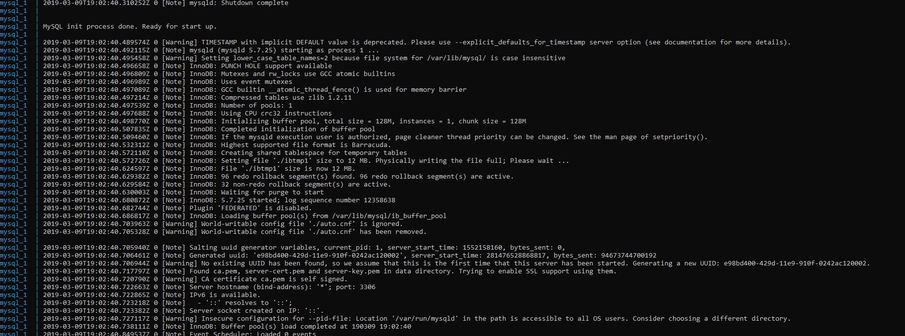

DOCKER
5 pts Your dockerfile. Please provide a link to this file rather than a screen capture. 
[Docker file link](Dockerfile)

5 pts Your running docker instance as shown by a ps command. 

 
5 pts Your browser accessing the main page of the website from your local container. 
5 pts The output from the docker-compose up command. 

5 pts Your browser accessing the “Veterinarians” page of the website from your local container
when you run the application from the host system. 
I could not access the site through http://192.168.99.100:2376/ because of certificate and security errors.  Even after rebuilding the certificates and docker-machine restart I couldn't hit the page. 
5 pts A section of the stack trace generated when you attempt to run the application
container that has been updated to use MySQL. 

 

DOCKER COMPOSE - APP SERVER AND MYSQL 
5 pts Your updated docker-compose.yml file containing the application server, built from
your local Dockerfile, and the existing MySQL configuration. Please provide a link
to this file rather than a screen capture. 
[docker compose link](docker-compose.yml) 
5 pts Your updated application-mysql.properties file containing the URL change for
the database server. Please provide a link to this file rather than a screen capture. 
[application-mysql.properties file link](/src/main/resources/application-mysql.properties) 
5 pts The output from the docker-compose up command. 

 
I tried editing the files multiple times but could not get past this error. 
5 pts Your browser accessing the “Veterinarians” page of the website from your local container. 
Could not build site after trying to debug error...  I entered the image config exactly as demonstrated.
